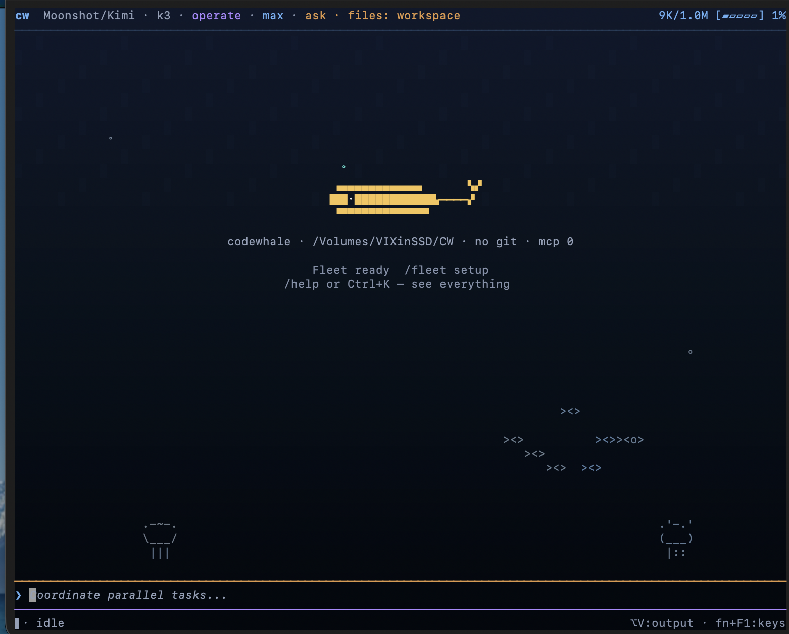

<!-- source: README.md sha256:f25cf99b305a -->
# Nestlone

Sebuah coding agent sumber terbuka untuk terminal Anda — bawa model pilihan Anda sendiri.

Nestlone berawal sebagai pengalaman asli (native) untuk DeepSeek. Sejak saat itu, proyek ini berkembang menjadi proyek yang didorong oleh komunitas: satu coding harness yang memenuhi kebutuhan komunitas internasional yang terus berkembang serta mendukung sebanyak mungkin model dan penyedia (provider) — mengutamakan model terbuka, baik yang di-host maupun lokal, tanpa membeda-bedakan satu sama lain.

Berikan penyedia, model, dan tugas: Nestlone akan membaca kode Anda, mengedit berkas, menjalankan perintah, serta memeriksa hasil kerjanya sendiri, lalu berhenti setelah pekerjaan selesai atau ketika membutuhkan arahan Anda. Ganti model di tengah tugas dengan `/model`. Bekerja secara interaktif di TUI, atau jalankan `nestlone exec` dalam skrip dan CI. Dibuat menggunakan Rust, berlisensi MIT, dan berjalan langsung di mesin Anda sendiri.

Kami selalu membuka kesempatan bagi para kontributor dan cara untuk terus berkembang. Jika model atau penyedia yang Anda gunakan belum tersedia, atau ada hal yang tidak berjalan semestinya, memberi tahu kami adalah salah satu kontribusi paling berharga yang bisa Anda lakukan — lihat [Kontribusi](#kontribusi).

[English](README.md) · [简体中文](README.zh-CN.md) · [日本語](README.ja-JP.md) · [Tiếng Việt](README.vi.md) · [Bahasa Indonesia](README.id.md) · [한국어](README.ko-KR.md) · [Español](README.es-419.md) · [Português](README.pt-BR.md) · [codewhale.net](https://codewhale.net/) · [Docs](docs) · [Changelog](CHANGELOG.md)

[](https://github.com/bdugsj/nestlone/actions/workflows/ci.yml)
[](https://crates.io/crates/nestlone-cli)
[](https://www.npmjs.com/package/nestlone)



## Instalasi

```bash
npm install -g nestlone
```

Cargo, Docker, Nix, Scoop, arsip biner pra-kemas, Android/Termux, serta mirror CNB bagi siapa pun yang memiliki keterbatasan akses ke GitHub dibahas secara lengkap di [docs/INSTALL.id.md](docs/INSTALL.id.md) ([English](docs/INSTALL.md)). Bermigrasi dari `deepseek-tui`? Konfigurasi dan sesi Anda akan tetap dipertahankan — lihat [docs/REBRAND.id.md](docs/REBRAND.id.md) ([English](docs/REBRAND.md)).

## Penggunaan

```bash
nestlone auth set --provider deepseek   # or export ANTHROPIC_API_KEY, etc.
nestlone                                # open the TUI
nestlone exec "fix the failing test"    # headless
nestlone web                            # local browser client on 127.0.0.1
```

Di dalam TUI: `/model` mengganti penyedia dan model sekaligus, `/fleet` menjalankan tim pekerja (workers), dan `/restore` membatalkan satu langkah (turn). Saat composer dalam keadaan diam (idle), `Tab` beralih antar mode Plan / Act / Operate dan `Shift+Tab` beralih antar postur izin Ask / Auto-Review / Full Access. `!` menjalankan perintah shell melalui alur persetujuan normal.

## Fitur & Kapabilitas

- **Model mana saja, penyedia apa saja.** DeepSeek, Claude, GPT, Kimi, GLM, dan 30+ penyedia lainnya, ditambah vLLM, SGLang, atau Ollama milik Anda sendiri tanpa memerlukan API key — semuanya melalui satu runtime dan satu kumpulan alat. Batas konteks dan harga diambil dari rute sebenarnya, dan harga yang tidak diketahui ditampilkan sebagai *unknown* daripada $0.
- **Read-only sampai Anda memberi izin lebih.** Mode Plan tidak dapat mengubah berkas, dan gerbang persetujuan memproteksi perintah berisiko. Ketika sandbox OS membungkus perintah, Nestlone akan menginformasikannya: Seatbelt pada macOS (jika tersedia), serta opsi bubblewrap di Linux. Berkas `constitution.json` repositori dikompilasi menjadi pembatas penulisan yang bahkan tidak dapat dilewati oleh mode Full Access.
- **Pekerjaan yang dapat dilanjutkan.** Fleet mencatat setiap langkah ke ledger bertipe append-only, sehingga `fleet resume` dapat melanjutkan pekerjaan tepat di mana Anda meninggalkannya.

## Pelajari Lebih Lanjut

- [docs/PROVIDERS.id.md](docs/PROVIDERS.id.md) ([English](docs/PROVIDERS.md)) — setiap rute penyedia: hosted, gateway, dan lokal
- [docs/FLEET.id.md](docs/FLEET.id.md) ([English](docs/FLEET.md)) — fleet, ledger, dan kelanjutan sesi (resume)
- [docs/CONFIGURATION.id.md](docs/CONFIGURATION.id.md) ([English](docs/CONFIGURATION.md)) — `config.toml`, hooks, dan konstitusi
- [docs/WEB.id.md](docs/WEB.id.md) ([English](docs/WEB.md)) — klien browser berbasis loopback-only dan batas autentikasi sekali pakainya
- [docs/LOCALIZATION.id.md](docs/LOCALIZATION.id.md) ([English](docs/LOCALIZATION.md)) — matriks lokalisasi & panduan terjemahan

Topik lainnya — [mode eksekusi](docs/MODES.id.md) ([English](docs/MODES.md)), [pintasan tombol](docs/KEYBINDINGS.id.md) ([English](docs/KEYBINDINGS.md)), detail sandbox, [MCP](docs/MCP.id.md) ([English](docs/MCP.md)), runtime API, dan arsitektur — tersedia di dalam direktori [docs](docs) serta di [codewhale.net](https://codewhale.net/).

## Kontribusi

Issue, PR, langkah reproduksi masalah, log, dan permintaan fitur semuanya merupakan kontribusi nyata pada proyek ini, dan kami sangat menyambut kontribusi pertama Anda. Jika sebuah PR tidak dapat di-merge secara langsung, maintainer akan memetik bagian yang berfungsi dan tetap memberikan kredit kepada pembuatnya — dalam commit, changelog, dan [docs/CONTRIBUTORS.md](docs/CONTRIBUTORS.md).

- [Open issues](https://github.com/bdugsj/nestlone/issues) — tempat awal yang baik untuk kontribusi pertama
- [CONTRIBUTING.id.md](CONTRIBUTING.id.md) ([English](CONTRIBUTING.md)) — alur pengembangan dan prosedur PR
- [docs/CONTRIBUTORS.md](docs/CONTRIBUTORS.md) — setiap orang yang telah membentuk proyek ini
- [Dukung proyek ini](https://www.buymeacoffee.com/hmbown)

Terima kasih kepada [DeepSeek](https://github.com/deepseek-ai) untuk model dan dukungan yang mengawali proyek ini, [DataWhale](https://github.com/datawhalechina) 🐋 atas sambutan hangat ke dalam keluarga Whale Brother, serta [OpenWarp](https://github.com/zerx-lab/warp) dan [Open Design](https://github.com/nexu-io/open-design) atas kolaborasi dalam menghadirkan pengalaman terminal-agent yang lebih baik.

## Lisensi

[MIT](LICENSE). Sebuah proyek komunitas independen, tidak terafiliasi dengan penyedia model mana pun.

[](https://www.star-history.com/?repos=bdugsj%2Fnestlone&type=date)
